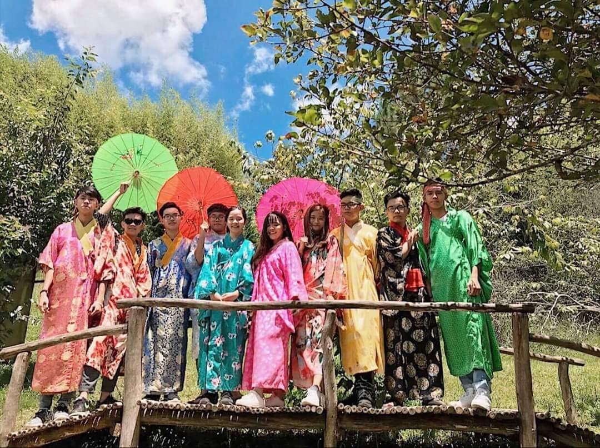
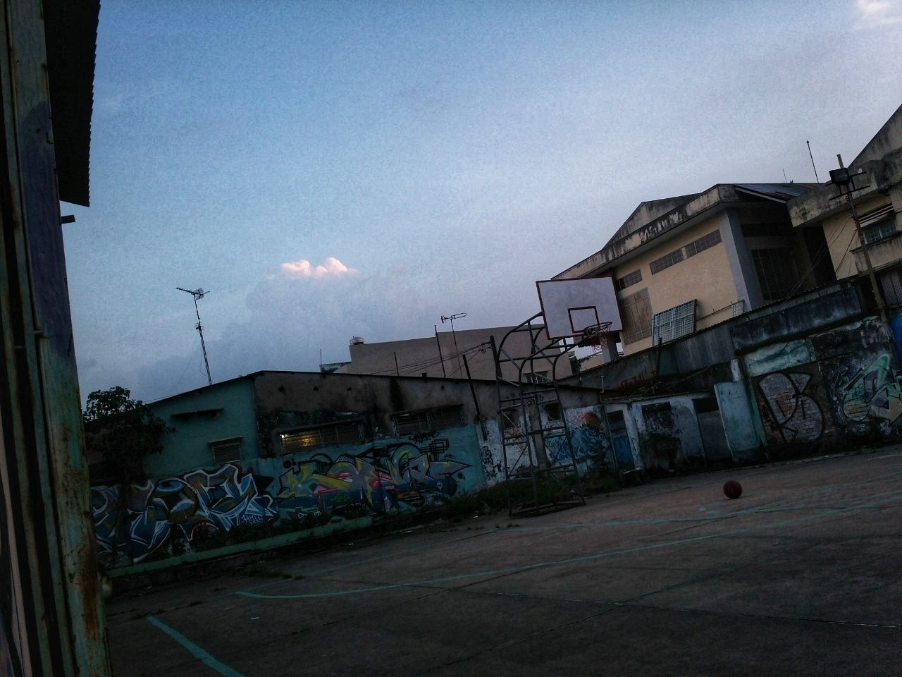

# Hello guys! :sunflower:  
### My name is ***Minh Tri*** :boy:, welcome to my profile 👋
### :full_moon: Introduction
* :birthday: **Age**: 18 
* :house:  **Location**: Bien Hoa city, Dong Nai province
* :handbag: **Job**: Freshman in the University of Information Technology

    * My department is: Computer Science
    * My current class is: KHCL.2
* :star: **Hobbies**:
    * Coding :computer:
    * Playing sport :basketball:
    * Hangout with friends :two_men_holding_hands:
    * Watching films :tv:      

---

### :first_quarter_moon: **Languages** and **Tools**

####  Languages: 

#### Tools:

<code></code>
<code></code>
<code></code>
<code></code>
<code></code>
<code></code>
<code></code>

---

## :new_moon: **Find me**

 |  | 

---

## ⭐ **Some pictures i like** 
<table style="width:100%; table-layout:fixed">
 <tr>
    <th>Vung Tau trip with my class 🏖️</th>
    <th>Our memorable DaLat trip ⛰️</th>
  </tr>  
   <tr>
      <td>
         
  

      </td>
      <td>
           
  

      </td>
     
   </tr>
   <tr>
       <th>My fav basketball court 🏀</th>
       <th>School basketball team 🔥 </th>
   </tr>
   <tr>
      <td>
       
  

      </td>
       <td>
           
  

      </td>
      
   </tr>
   

</table>

<!--
>some pictures i like 
* **[Facebook](https://www.facebook.com/profile.php?id=100006472204856)**
* **[Instagram](https://www.instagram.com/minnhtrii/)**

**Minhtri0817/Minhtri0817** is a ✨ _special_ ✨ repository because its `README.md` (this file) appears on your GitHub profile.
#### Languages:
* :one: **c++**   
* :two: **html**  
* :three: **css**  
* :four: **javascript** 
Here are some ideas to get you started:

- 🔭 I’m currently working on ...
- 🌱 I’m currently learning ...
- 👯 I’m looking to collaborate on ...
- 🤔 I’m looking for help with ...
- 💬 Ask me about ...
- 📫 How to reach me: ...
- 😄 Pronouns: ...
- ⚡ Fun fact: ...
-->
